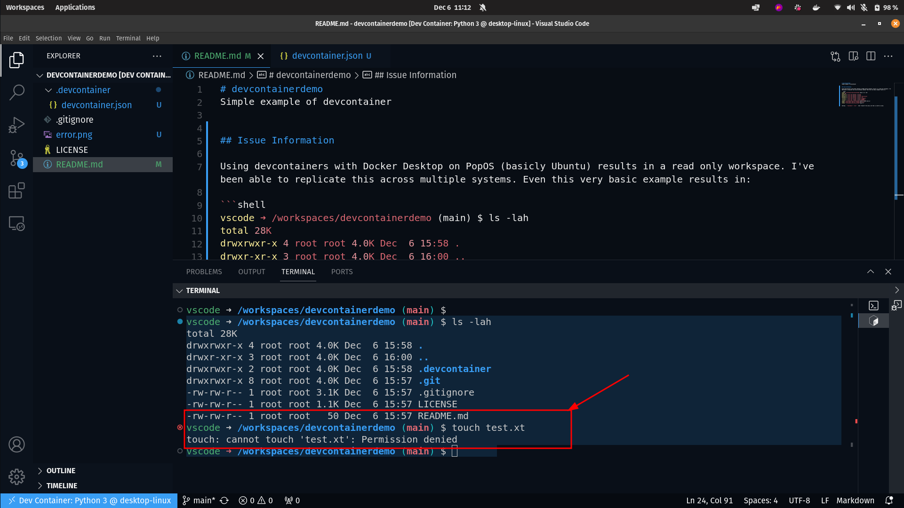

# devcontainerdemo
Simple example of devcontainer


## Issue Overview

Using devcontainers with Docker Desktop on PopOS (basicly Ubuntu) results in a read only workspace. I've been able to replicate this across multiple systems. Even this very basic example results in:

```shell
vscode ➜ /workspaces/devcontainerdemo (main) $ ls -lah
total 28K
drwxrwxr-x 4 root root 4.0K Dec  6 15:58 .
drwxr-xr-x 3 root root 4.0K Dec  6 16:00 ..
drwxrwxr-x 2 root root 4.0K Dec  6 15:58 .devcontainer
drwxrwxr-x 8 root root 4.0K Dec  6 15:57 .git
-rw-rw-r-- 1 root root 3.1K Dec  6 15:57 .gitignore
-rw-rw-r-- 1 root root 1.1K Dec  6 15:57 LICENSE
-rw-rw-r-- 1 root root   50 Dec  6 15:57 README.md
vscode ➜ /workspaces/devcontainerdemo (main) $ touch test.xt
touch: cannot touch 'test.xt': Permission denied
vscode ➜ /workspaces/devcontainerdemo (main) $ 
```

[](docs/CONTRIBUTING.md)




Setting ```"remoteUser": "root"``` does "resovle" the issue, but that is itself an issue. 


### System information

* __Docker Desktop Version:__ 4.26.0 (130397)
* __Engine:__ 24.0.7
* __Compose:__ v2.23.3-desktop.2
* __Credential Helper:__ v0.7.0
* __K8s:__ v1.28.2

* __VS Code:__
  * Version: 1.84.2
  * Commit: 1a5daa3a0231a0fbba4f14db7ec463cf99d7768e
  * Date: 2023-11-09T10:50:47.800Z
  * Electron: 25.9.2
  * ElectronBuildId: 24603566
  * Chromium: 114.0.5735.289
  * Node.js: 18.15.0
  * V8: 11.4.183.29-electron.0
  * OS: Linux x64 6.5.6-76060506-generic

```shell
 % docker --version
Docker version 24.0.7, build afdd53b
```

```shell
kwhatcher@pop-os ~/Work/devcontainerdemo
 % neofetch
             /////////////                kwhatcher@pop-os 
         /////////////////////            ---------------- 
      ///////*767////////////////         OS: Pop!_OS 22.04 LTS x86_64 
    //////7676767676*//////////////       Host: Pangolin pang12 
   /////76767//7676767//////////////      Kernel: 6.5.6-76060506-generic 
  /////767676///*76767///////////////     Uptime: 1 day, 23 hours, 26 mins 
 ///////767676///76767.///7676*///////    Packages: 2640 (dpkg), 38 (flatpak), 10 (snap) 
/////////767676//76767///767676////////   Shell: zsh 5.8.1 
//////////76767676767////76767/////////   Resolution: 1920x1080, 2560x1440 
///////////76767676//////7676//////////   DE: GNOME 42.5 
////////////,7676,///////767///////////   WM: Mutter 
/////////////*7676///////76////////////   WM Theme: Pop 
///////////////7676////////////////////   Theme: Pop-dark [GTK2/3] 
 ///////////////7676///767////////////    Icons: Pop [GTK2/3] 
  //////////////////////'////////////     Terminal: gnome-terminal 
   //////.7676767676767676767,//////      CPU: AMD Ryzen 7 6800U with Radeon Graphics (16) @ 4.768GHz 
    /////767676767676767676767/////       GPU: AMD ATI 04:00.0 Rembrandt 
      ///////////////////////////         Memory: 19022MiB / 31317MiB 
         /////////////////////
             /////////////                                        
                                                                  


```shell
% code -s
Version:          Code 1.84.2 (1a5daa3a0231a0fbba4f14db7ec463cf99d7768e, 2023-11-09T10:50:47.800Z)
OS Version:       Linux x64 6.5.6-76060506-generic
CPUs:             AMD Ryzen 7 6800U with Radeon Graphics (16 x 2080)
Memory (System):  30.58GB (9.96GB free)
Load (avg):       2, 2, 2
VM:               0%
Screen Reader:    no
Process Argv:     . --crash-reporter-id ********
GPU Status:       2d_canvas:                              enabled
                  canvas_oop_rasterization:               disabled_off
                  direct_rendering_display_compositor:    disabled_off_ok
                  gpu_compositing:                        enabled
                  multiple_raster_threads:                enabled_on
                  opengl:                                 enabled_on
                  rasterization:                          enabled
                  raw_draw:                               disabled_off_ok
                  video_decode:                           enabled
                  video_encode:                           disabled_software
                  vulkan:                                 disabled_off
                  webgl:                                  enabled
                  webgl2:                                 enabled
                  webgpu:                                 disabled_off
... 
Remote:           Dev Container: Python 3 @ desktop-linux
OS Version:       Linux x64 6.5.11-linuxkit
CPUs:             AMD Ryzen 7 6800U with Radeon Graphics (16 x 2694)
Memory (System):  7.41GB (4.71GB free)

```

